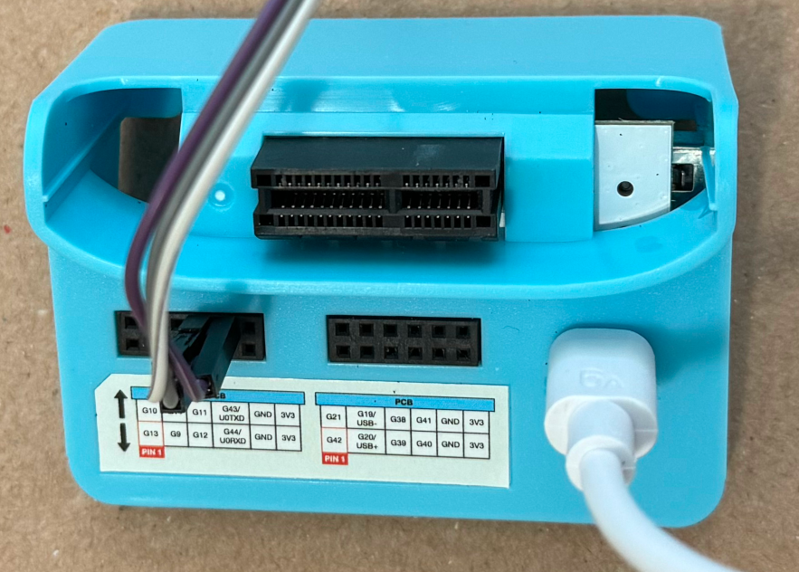
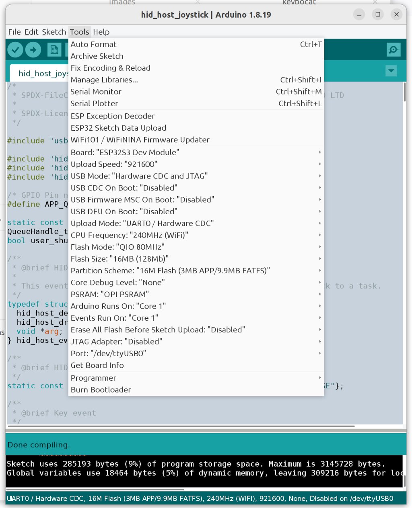

# ESP32 USB Host HID

Port of the ESP-IDF USB host HID example to the Arduino IDE with minimal
changes. This is an Arduino library so install it in your Arduino library
directory. The easiest way to do this is to download this repo as ZIP file.
Then use the IDE "Add ZIP library" option to install this code into the
correct directory.

Tested using Arduino IDE 1.8.19 and
[Espressif ESP32-BOX-S3-3 with USB host dock](https://github.com/espressif/esp-box/blob/master/docs/hardware_overview/esp32_s3_box_3/hardware_overview_for_box_3.md)


In the picture above, the USB keyboard is plugged into the blue dock. The USB
power bank powers the dock, the USB keyboard, and the ESP32 Box. The USB UART
cable with the jumper wires connects to UART0 for Serial Console and IDE
upload.

The code should work with other ESP32S2 or ESP32S3 boards but you must connect
wires to the correct ESP32 pins to a USB Type A connector. And connect 5V power
out to the Type A connector.

## Serial Console

Since the USB OTG port is on host mode, it cannot be used for Serial Console.
Set 'USB CDC on Boot: "Disabled"' so Serial Console and code upload are done
using UART0.



In the above picture, G43/U0TXD (UART0 transmit), G44/U0RXD (UART0 receive),
and GND are connected to a USB TTL (3.3V) UART cable. UART0 is used for Serial
Console and IDE upload. The USB Type C cable provides 5V to power the dock, the
USB keyboard, and the ESP32 Box. In this case, power is provided by USB power
bank capable of supplying 5V up to 2A. 2A is more than enough for the ESP32 Box
and the USB keyboard.

## Arduino IDE ESP32 build options



To get more details on how the code works, set the Core Debug Level to "Info".

Use the BOOT and RESET buttons on the side of the ESP32 Box to put the ESP32 in
to bootloader upload mode. After the upload is done, RESET or power cycle the
ESP32 Box to start running the sketch.

## ESP-IDF USB Host docs

* [Espressif ESP-IDF USB Host](https://docs.espressif.com/projects/esp-idf/en/latest/esp32s3/api-reference/peripherals/usb_host.html)

## Files

The following files are unchanged files from Espressif ESP-IDF. The README.md
was renamed to avoid conflicts. The LICENSE is also unchanged.

* hid.h
* hid_host.c
* hid_host.h
* hid_usage_keyboard.h
* hid_usage_mouse.h
* LICENSE
* README_espressif_usb_host_hid.md

There is one exception. hid.h has a small change to avoid a name conflict
with the ESP32-BLE-Keyboard library.

## Examples

### hid_host_example
The following INO file is derived from the Espressif hid_host_example.c file
with small modifications for the Arduino IDE. The README.md file is unchanged.

* examples/hid_host_example/hid_host_example.ino
* examples/hid_host_example/README.md

### hid_host_joystick
The following INO file is derived from the Espressif hid_host_example.c file
with support for some gaming joysticks. The README.md file below has more
details.

* examples/hid_host_example/hid_host_joystick.ino
* examples/hid_host_example/README.md

### USBHostKeyboardBLE
A simple USB keyboard to BLE keyboard converter example.

* examples/USBHostKeyboardBLE/USBHostKeyboardBLE.ino
* examples/USBHostKeyboardBLE/README.md

## Sample output

Sample Serial Console output on UART0.

```
ESP-ROM:esp32s3-20210327
Build:Mar 27 2021
rst:0x1 (POWERON),boot:0x3 (DOWNLOAD(USB/UART0))
waiting for download

Keyboard
hello
```
